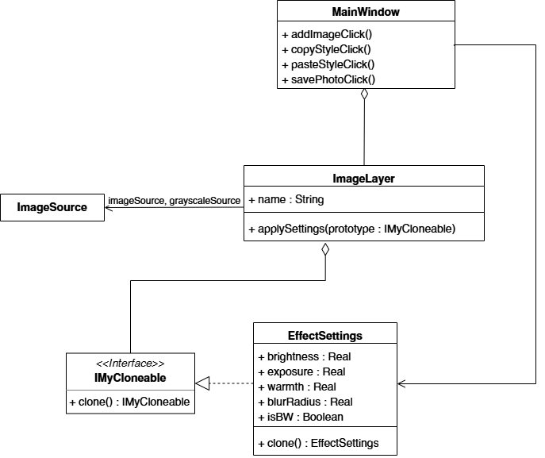
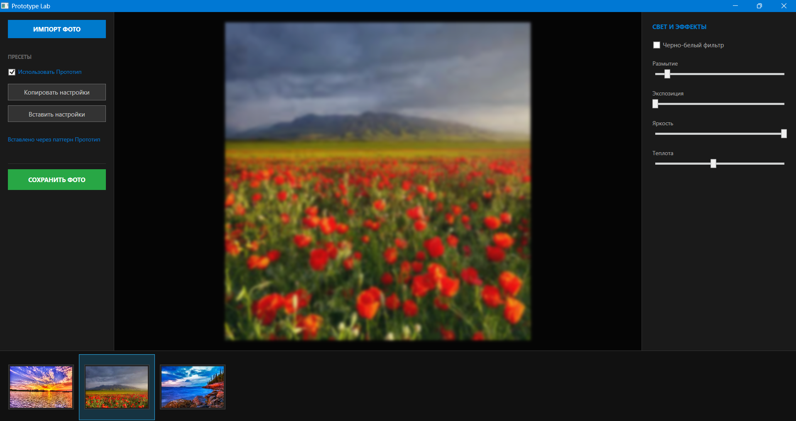

# Лабораторная работа 1. Реализация паттерна «Прототип» на C#

## Цель работы
* Изучить концепцию порождающих паттернов проектирования, в частности паттерна «Прототип».
* Реализовать механизм клонирования для переноса настроек между элементами системы.
* Разработать GUI-приложение для демонстрации работы.

## Описание предметной области
В рамках работы разработан MVP фоторедактора, предназначенный для пакетной обработки фотографий. Основная задача - обеспечить пользователю возможность быстрого переноса настроек коррекции (яркость, экспозиция, теплота, размытие, Ч/Б фильтр) с одной фотографии на другую. 

## Архитектурное решение
Для решения задачи выбран паттерн **Прототип**.

**Основные компоненты:**
* Интерфейс IMyCloneable: определяет абстрактный контракт для всех объектов, поддерживающих клонирование.
* Класс EffectSettings: хранит состояние всех фильтров. Реализует метод `clone()`, который создает точную независимую копию текущего набора настроек через `MemberwiseClone`.
* Класс ImageLayer: объединяет графические данные и объект настроек.
* Класс MainWindow: управляет коллекцией слоев и хранит «буфер обмена» для скопированного прототипа.

## Диаграмма классов


Интерфейс IMyCloneable и класс EffectSettings реализуют паттерн Прототип, позволяя объекту настроек создавать свои точные и независимые копии через метод clone(). Класс ImageLayer агрегирует настройки через интерфейс, что позволяет изменять логику фильтров, не затрагивая основной код управления фотографиями. MainWindow выступает в роли клиента, который инициирует клонирование прототипа для быстрого переноса параметров обработки между разными изображениями.

## Реализация паттерна
Главная логика паттерна сосредоточена в методе клонирования настроек и их применении через интерфейс:

```csharp
// Реализация метода в классе EffectSettings
public EffectSettings clone()
{
    // Поверхностное копирование значений всех полей в новый объект
    return (EffectSettings)this.MemberwiseClone();
}

// Применение настроек в классе ImageLayer
public void applySettings(IMyCloneable prototype)
{
    // Клонируем прототип, чтобы фото получило независимый объект настроек
    this.settings = (EffectSettings)prototype.clone();
}
```

## Сравнение режимов (без паттерна и с паттерном)
Для демонстрации в программу встроен переключатель режимов.

### Вариант без паттерна (NoPatternProcessor.cs):
Используется ручное копирование свойств. При таком подходе:
* Код UI должен «знать» о каждом поле (яркость, теплота и т.д.), что нарушает инкапсуляцию.
* При добавлении нового фильтра (например, «Насыщенность») необходимо вручную изменять код во всех методах копирования и вставки.

### Вариант с паттерном (PatternProcessor.cs):
* Код управления остается неизменным при расширении списка фильтров. 
* Логика копирования полностью скрыта внутри самого объекта настроек.

## Описание пользовательского интерфейса
Интерфейс приложения выполнен в стиле профессиональных редакторов:

1. Центральная область: отображает выбранное фото с примененными эффектами.
2. Нижняя лента: позволяет быстро переключаться между загруженными фотографиями.
3. Правая панель: содержит ползунки управления (экспозиция, яркость, теплота, размытие) и чекбокс ч/б фильтра.
4. Левая панель: содержит кнопки импорта, управления пресетами и переключатель для демонстрации работы паттерна.



## Выводы
В ходе выполнения работы был реализован паттерн «Прототип» на языке C#. 

Внедрение паттерна позволило инкапсулировать сложную логику копирования состояний внутри класса данных `EffectSettings`. После вставки стиля изменения на одной фотографии не влияют на другие, так как каждый объект владеет собственной копией настроек. Добавление новых эффектов теперь не требует переписывания контроллеров интерфейса в `MainWindow`.
