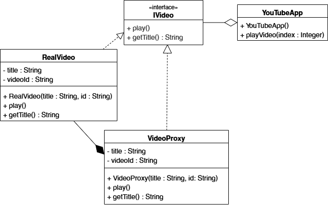

# Лабораторная работа 2. Реализация паттерна "Заместитель" на C++

## Цель работы
1. Изучить концепцию структурных паттернов проектирования, в частности паттерна "Заместитель".
2. Реализовать механизм инициализации для оптимизации потребления ресурсов.
3. Разработать веб-приложение для демонстрации работы паттерна.

## Описание предметной области
В рамках работы разработан видеохостинг MyTube. Основная задача приложения - отображение ленты видеороликов и их воспроизведение. 
В данной предметной области создание объекта "Видео" является ресурсозатратным процессом, так как требует инициализации видео и выделения памяти.

## Архитектурное решение
Для решения задачи выбран паттерн **Заместитель**.

**Основные компоненты:**
*   Интерфейс IVideo: определяет общий контракт для реального видео и его заместителя (методы `play()`, `getTitle()`).
*   Класс VideoProxy: легковесный объект, который хранит только метаданные (название и ID). Реализует логику отложенного создания реального объекта.
*   Класс RealVideo: тяжелый объект, который реально загружает видео из интернета и показывает его на странице.
*   Класс YouTubeApp: управляет коллекцией видеороликов, работая с ними через интерфейс.

## Диаграмма классов


## Реализация паттерна

Главная логика паттерна сосредоточена в перехвате вызова метода воспроизведения:

```cpp
// Реализация метода в классе VideoProxy
void VideoProxy::play() {
    // Проверка: если реальный объект еще не создан
    if (!realVideo) {
        // Инициализация загрузки видео
        std::cout << "Инициирую загрузку ресурсов..." << std::endl;
        realVideo = std::make_unique<RealVideo>(title, videoId);
    }
    // Передаем выполнение реальному субъекту
    realVideo->play();
}
```

## Сравнение режимов

Для наглядности в проект встроен переключатель между режимами.

1. Вариант с паттерном:
    - При запуске создаются только прокси-объекты.
    - Потребление памяти минимально.
    - Создание RealVideo происходит только после клика пользователя.
2. Вариант без паттерна:
    - Все объекты RealVideo инициализируются сразу при старте.
    - Высокая нагрузка на систему до начала взаимодействия с пользователем.

## Описание пользовательского интерфейса


## Вывод
В ходе выполнения работы был реализован паттерн "Заместитель" на языке C++. Внедрение паттерна позволило отделить хранение метаданных от инициализации тяжелых ресурсов. Это решило проблему избыточного потребления оперативной памяти и обеспечило мгновенный старт приложения независимо от количества элементов в списке.