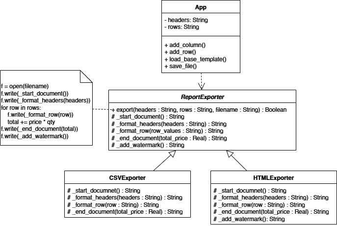
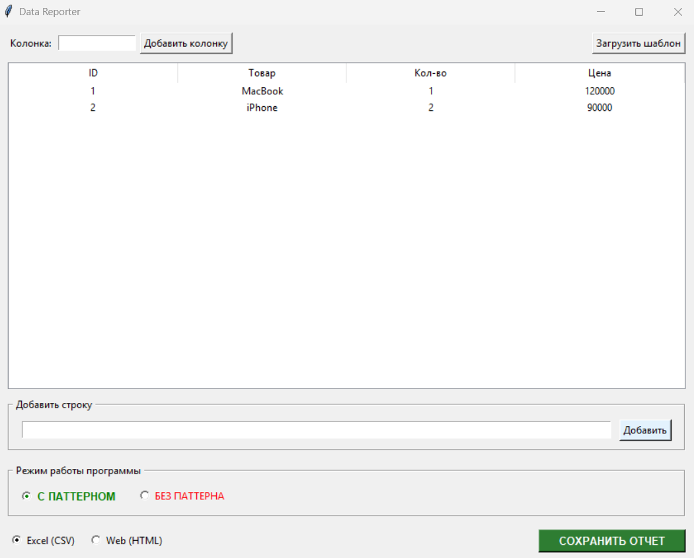

# Лабораторная работа 4. Реализация паттерна «Шаблонный метод» на Python

## Цель работы
* Изучить концепцию поведенческих паттернов проектирования, в частности паттерна «Шаблонный метод».
* Реализовать скелет алгоритма для экспорта данных, позволяя изменять отдельные шаги формирования документа без изменения общей структуры.
* Разработать GUI-приложение для демонстрации работы паттерна на примере генератора отчетов.

## Описание предметной области
В рамках работы разработан Data Reporter - универсальный конструктор отчетов. Приложение позволяет пользователю динамически формировать структуру таблицы (добавлять колонки и строки), рассчитывать итоговую сумму по чеку и экспортировать результат в различные форматы (CSV, HTML).

## Архитектурное решение
Для решения задачи выбран паттерн **Шаблонный метод**.

**Основные компоненты:**
* Класс `ReportExporter`: определяет шаблонный метод `export()`, который задает последовательность шагов (открытие файла, запись заголовка, итерация по строкам с расчетом суммы, запись футера).
* Классы `CSVExporter` и `HTMLExporter`: реализуют специфические шаги форматирования данных под конкретные стандарты файлов (разделители-запятые для Excel или теги `<table>` для веба).
* Класс `App`: графический интерфейс, предоставляющий пользователю инструменты для управления данными и выбора способа экспорта.

## Диаграмма классов


Абстрактный класс ReportExporter реализует скелет алгоритма в методе export(), обеспечивая единообразие процесса сохранения файлов любого формата. Классы CSVExporter и HTMLExporter переопределяют низкоуровневые шаги форматирования строк, не вмешиваясь в логику перебора данных или расчет итоговой суммы. Класс App взаимодействует с абстракцией ReportExporter.

## Реализация паттерна
Главная логика паттерна сосредоточена в базовом классе, который управляет процессом, вызывая методы-заглушки наследников:

```csharp
// Шаблонный метод в абстрактном классе ReportExporter
def export(self, headers, rows, filename):
    with open(filename, 'w', encoding='utf-8') as f:
        // Инвариантные шаги и вызов вариативных методов
        f.write(self._start_document())
        f.write(self._format_headers(headers))
        
        // Общая логика расчета, скрытая от наследников
        total_sum = self._calculate_total(rows) 
        
        for row in rows:
            f.write(self._format_row(row))
            
        f.write(self._end_document(total_sum))
        
        watermark = self._add_watermark()
        if watermark: f.write(watermark)
```

## Сравнение режимов (без паттерна и с паттерном)
Для наглядной демонстрации встроен переключатель режимов.

### Вариант без паттерна:
Каждая функция экспорта (export_to_csv, export_to_html) содержит дублирующийся код. При таком подходе:
* Повторение логики открытия/закрытия файлов.
* Дублирование алгоритма поиска индексов колонок цена и кол-во.
* Дублирование математических расчетов суммы.
* Изменение формулы расчета требует правки кода во всех функциях одновременно.

### Вариант с паттерном:
* Математика и логика обхода данных написаны один раз.
* Наследники занимаются только строками (текстом), они не знают о существовании файлов или расчетах.
* Добавление нового формата требует реализации только правил оформления строки, а не всего процесса целиком.

## Описание пользовательского интерфейса
Интерфейс приложения разделен на три логические зоны:

1. Настройка структуры: поле добавления произвольных колонок и кнопка сброса к базовому шаблону.
2. Редактор данных: таблица для визуального контроля и панель ввода новых строк через запятую.
3. Панель управления: выбор режима реализации, выбор формата и кнопка сохранения.



## Выводы
В ходе выполнения работы был реализован паттерн «Шаблонный метод» на языке Python.

Применение паттерна позволило отделить стабильный алгоритм формирования финансового отчета от часто меняющихся деталей представления данных. Это обеспечило высокую связность кода и упростило поддержку приложения: расчеты итогов надежно защищены в базовом классе, а визуальное оформление документов легко расширяется через наследование.