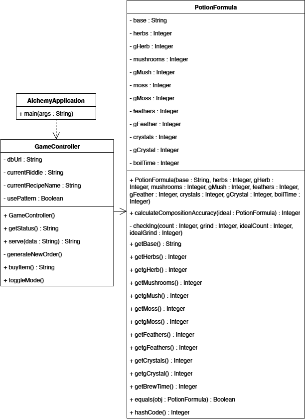
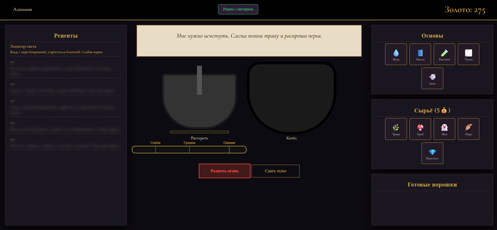

# Лабораторная работа №4. Реализация паттерна «Объект-значение» (Value Object) на Java

## Цель работы
* Изучить концепцию структурных паттернов проектирования, в частности паттерна объект-значение.
* Реализовать модель, где состояние объекта определяется набором его атрибутов, а не уникальным идентификатором.
* Продемонстрировать преимущества инкапсуляции бизнес-логики и обеспечения неизменяемости данных.
* Разработать клиент-серверное приложение с интеграцией базы данных SQLite.

## Описание предметной области
В рамках работы разработан симулятор «Алхимик». Игрок выступает в роли алхимика, который принимает заказы-загадки от клиентов. Для успешного выполнения заказа необходимо собрать точную формулу зелья, которая включает:
* Выбор одной из 5 основ.
* Точное количество 5 видов ингредиентов.
* Соблюдение стадии помола для каждого ингредиента (от целого до пыли).
* Соблюдение времени варки на огне.

## Архитектурное решение
Для управления составом зелья выбран паттерн объект-значение.

**Основные компоненты:**
* Класс `PotionFormula`: сам Value Object. Он инкапсулирует в себе 12 параметров состава и времени. Объект не имеет ID, является неизменяемым и сам содержит логику оценки точности рецепта.
* Класс `GameController`: управляет состоянием игры, генерирует заказы и взаимодействует с БД.
* База данных `SQLite`: хранит золото игрока и список разблокированных рецептов.
* Фронтенд (HTML5/JS): интерактивное рабочее место алхимика.

## Диаграмма классов
На диаграмме отражена структура системы. Класс `PotionFormula` выделяется отсутствием поля `id` и наличием методов сравнения по значению (`equals`, `hashCode`).



## Реализация паттерна
Главная логика паттерна сосредоточена в классе `PotionFormula`. Все поля объекта инициализируются один раз через конструктор и защищены от изменений:

```java
// Реализация Value Object в классе PotionFormula
public final class PotionFormula {
    private final Base base;
    private final int herbs, gHerb;
    private final int mushrooms, gMush;
    // остальные ингредиенты
    private final int brewTime;

    public PotionFormula(...) {
        // Валидация данных при создании
        this.base = base;
        this.brewTime = Math.max(0, Math.min(100, brewTime));
        // ...
    }

    // Инкапсулированная бизнес-логика расчета точности
    public int calculateCompositionAccuracy(PotionFormula ideal) {
        if (this.base != ideal.base) return 0;
        int penalty = 0;
        // Расчет штрафов на основе сравнения значений полей
        penalty += Math.abs(this.herbs - ideal.herbs) * 20;
        // ...
        return Math.max(0, 100 - penalty);
    }
}
```

## Сравнение режимов (с паттерном и без паттерна)
В приложение встроен переключатель, демонстрирующий разницу.

### Вариант без паттерна:
Логика сравнения рецептов вынесена напрямую в метод контроллера.
* Вместо одного объекта контроллер оперирует 12-ю отдельными переменными типа `int` и `String`.
* Легко перепутать порядок аргументов (например, помол грибов и помол травы), так как они имеют одинаковый тип.
* Логика расчетов «засоряет» код, отвечающий за обработку сетевых запросов.

### Вариант с паттерном:
* Все данные о зелье передаются как единый неделимый объект.
* Объект `PotionFormula` гарантирует свою валидность.
* Контроллер делегирует расчеты объекту-значению, вызывая всего один метод.

## Описание пользовательского интерфейса

Интерфейс разделен на рабочие зоны:

1. Список рецептов с динамической разблокировкой (эффект блюра для неизвестных составов).
2. Рабочий стол: 
   * Свиток с заказом клиента.
   * Интерактивная ступка (измельчение ингредиентов кликами).
   * Котел с анимацией плавающих предметов.
   * Шкала варки с уровнями выдержки.
3. Полки: ингредиенты и основы, доступные для перетаскивания.

## Выводы
В ходе выполнения работы был реализован паттерн «Объект-значение» на языке Java.

Применение паттерна позволило превратить разрозненный набор технических данных (чисел и строк) в полноценную сущность предметной области. Это обеспечило защиту от ошибок при передаче данных и позволило изолировать сложную математику оценки зелий внутри одного компактного класса. Работа продемонстрировала, что Value Object делает систему более устойчивой к изменениям и легкой для понимания.

---

### Инструкция по запуску
1. Установите зависимости: `mvn clean install`.
2. Запустите сервер: файл `AlchemyApplication.java`.
3. Откройте в браузере: `http://localhost:8080`.
4. Для сброса прогресса удалите файл `.db` в корне проекта.